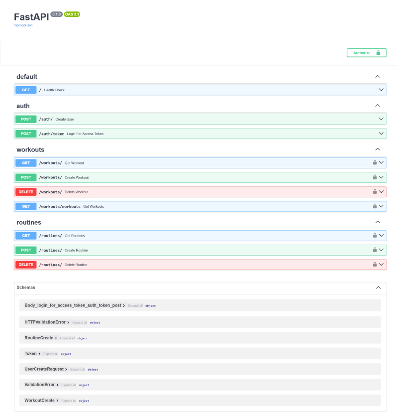

# 🏋️ FastAPI Workout Scheduler API

A **FastAPI** backend for managing workout schedules. This API allows **multiple users** to **create, read, and delete** workout schedules securely using authentication.



## 🚀 Features

- **User Authentication**  
- **CRUD Operations** for workout schedules  
- **Multi-user Support** (Users can manage their own schedules)  
- **SQLAlchemy ORM** for database operations  
- **Auto-generated API docs** with Swagger (`/docs`)  
- **FastAPI with Uvicorn** for high performance  

## 🛠️ Tech Stack

- **Backend:** FastAPI, Pydantic, SQLAlchemy  
- **Database:** SQLite  
- **Authentication:** OAuth2 + JWT  
- **Server:** Uvicorn  

## 📸 API Endpoints

| Method | Endpoint           | Description               | Auth Required |
|--------|--------------------|---------------------------|--------------|
| `POST` | `/register`        | Register a new user       | ❌ No        |
| `POST` | `/login`           | Login & get JWT token     | ❌ No        |
| `GET`  | `/workouts/`       | Get all workouts          | ✅ Yes       |
| `GET`  | `/workouts/{id}`   | Get a workout by ID       | ✅ Yes       |
| `POST` | `/workouts/`       | Create a new workout      | ✅ Yes       |
|`DELETE`| `/workouts/{id}`   | Delete a workout by ID    | ✅ Yes       |
| `GET`  | `/routines/`       | Get all routines          | ✅ Yes       |
| `POST` | `/routines/`       | Create a new routine      | ✅ Yes       |
|`DELETE`| `/routines/{id}`   | Delete a routine by ID    | ✅ Yes       |

## 🔧 Installation & Setup

1. **Clone the repository:**
   ```sh
   git clone https://github.com/GLRandula/workout-app.git
   cd workout-app
